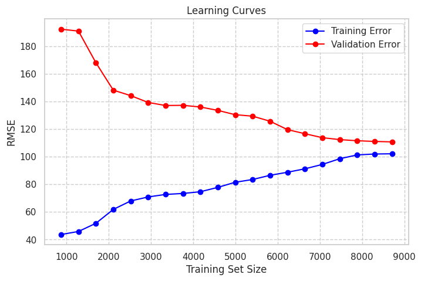

l# Ensembles (Bagging, Boosting, Stacking, Cascading) — Interview Notes

## 1. What is an Ensemble?

An **ensemble** combines multiple models ("base learners") so the group predicts
better than any single model — the ML version of "wisdom of crowds."

**Key requirement: diversity.** The more *different* (decorrelated) the base
models' errors are, the more the combination helps. Uncorrelated mistakes cancel
out when aggregated; identical models add nothing.

### Why it works — the number that makes it click ⭐
Take 3 independent models, each **70% accurate**, and majority-vote them. The
ensemble is right whenever ≥2 are right:

```
P(all 3 right)      = 0.7³              = 0.343
P(exactly 2 right)  = 3 × 0.7² × 0.3    = 0.441
                                   Total = 0.784   →  78.4%
```

**Three 70% models became a 78% model.** Push it to 5 models → 83.7%; to 101
models → >99.9%. This is the whole promise of ensembling in one calculation, and
it's a great thing to have ready when asked "why do ensembles work?"

**Now the two conditions the math quietly assumes** — and naming these is what
separates a strong answer:
1. **Each model must beat chance** (>50%). Voting models that are 40% accurate
   makes things *worse*, and just as fast.
2. **Errors must be independent.** If all 3 models fail on the same examples,
   majority vote returns exactly 70% — you gained nothing. Real models are
   partially correlated, so you land somewhere between 70% and 78%.

Condition 2 is why every ensemble method is fundamentally a **diversity-injection
scheme**: bagging varies the rows, Random Forest also varies the columns,
boosting varies the focus, stacking varies the algorithm.

Four main families:
1. **Bagging** (Bootstrap Aggregation) — e.g. Random Forest
2. **Boosting** — e.g. AdaBoost, GBDT, XGBoost
3. **Stacking** (and Blending)
4. **Cascading**

---

## 2. Bias–Variance Decomposition (the "why" of ensembles)

```
Expected Test Error = Bias² + Variance + Irreducible error (noise)
```

> ⚠️ The third term is **irreducible error** (noise inherent in the data),
> not "generalization error."

### 2.1 Why do the decomposition at all? (It's a debugging tool)

You train a model, compute test MSE, and it's high. *Now what* — collect more
data? add features? go bigger? add regularization? These pull in opposite
directions, so guessing wastes weeks.

Bias–variance decomposition converts **"my error is high"** into **"my error is
high *because of this specific term*,"** which maps to a specific fix. That is
the entire point of it, and it's the answer to "why do we do bias-variance
decomposition?" — a debugging framework, not a piece of trivia.
## Diagnostics for High Model Error (MSE)

To determine if high Test MSE is caused by **high bias** or **high variance**, follow these steps:

### 1. Train vs. Validation Error Split
* **High Bias (Underfitting):** High training error AND high validation error.
* **High Variance (Overfitting):** Low training error BUT high validation error.

### 2. Learning Curves (Error vs. Dataset Size)
* **Bias Indicator:** Both curves plateau early and flatten out close together at an unacceptably high error rate.
* **Variance Indicator:** A large, persistent gap remains between the training and validation curves.

### 3. Human/Bayes Error Baseline
* Compare training error to human performance or an established baseline.
* A large gap between baseline and training error signals a massive **avoidable bias** problem.

### 4. K-Fold Cross-Validation Consistency
* Check the standard deviation of error scores across data folds.
* Wildly fluctuating error scores across different folds signal **high variance**.

### 2.2 Setup

Assume training and test points are drawn from the same distribution:

```
y = f(xᵢ) + εᵢ      with   E[εᵢ] = 0,   Var(εᵢ) = σ²
```

- `f` = the true (unknown) function we're trying to recover
- `f̂` = the estimate we fit from a training set D

**Key point people miss:** `f̂` is itself a *random variable*. It depends on
which training set D we happened to draw. Every expectation `E[·]` below is over
**random draws of the training set, at a fixed x** — not over the data points in
one dataset.

### 2.3 The derivation

**What you actually need to produce on demand** is the result plus the *shape* of
the argument, not the algebra:

> "Split the error into noise plus estimation error. Then split estimation error
> by adding and subtracting the average model E[f̂]: what's left is how far the
> average model is from the truth (bias²) plus how much any one model deviates
> from that average (variance). The cross terms vanish."

That answer is enough for a DS interview. The algebra below is for when someone
says "show me."

<details>
<summary>🔍 <b>Full algebra</b> (senior/quant rounds — skip on a first pass)</summary>

**Step 1 — peel off the noise.**

```
Test MSE = E[(y − f̂(x))²]
         = E[(ε + f(x) − f̂(x))²]
         = E[ε²] + E[(f(x) − f̂(x))²]
```

The cross term drops because ε is independent of f̂ and E[ε] = 0.
`E[ε²] = σ²` → the irreducible error.

**Step 2 — add and subtract E[f̂(x)] inside the second term.**

```
E[(f − f̂)²] = E[ ((f − E[f̂]) − (f̂ − E[f̂]))² ]
            = (E[f̂] − f)²          ← bias²
            + E[(f̂ − E[f̂])²]       ← variance
            − 2·E[(f − E[f̂])(f̂ − E[f̂])]
```

**Why the cross term is zero:** `(f − E[f̂])` is a *constant* with respect to the
randomness in D, so it factors out of the expectation, and `E[f̂ − E[f̂]] = 0` by
definition of the mean.

</details>

```
⇒  Expected Test MSE = Bias[f̂]² + Var(f̂) + σ²
```

**One scope caveat worth knowing:** this is derived for **regression with squared
loss**. It doesn't decompose this cleanly for classification with 0–1 loss — but
everyone still uses "bias" and "variance" as shorthand for underfitting and
overfitting there. Just don't claim the *equation* holds exactly for
classification.

### 2.4 The three terms

| Term | Formula | Means | Symptom |
|---|---|---|---|
| **Bias²** | `(E[f̂(x)] − f(x))²` | How wrong the *average* model is | Underfitting |
| **Variance** | `E[(f̂(x) − E[f̂(x)])²]` | How much predictions wobble as the training data changes | Overfitting |
| **Irreducible / Bayes error** | `σ²` | Inherent unpredictability of the target | Nothing fixes it |

> The slides call the third term **Bayes error**; other sources call it
> irreducible error or noise floor. Same thing. Know both names.

### 2.5 The one-line mnemonic ⭐

| | **Bias** | **Variance** |
|---|---|---|
| **Shorthand** | **actual vs. predicted** | **predicted vs. average of all predictions** |
| **Formula** | `E[f̂(x)] − f(x)` | `E[(f̂(x) − E[f̂(x)])²]` |
| **Measured against** | the ground truth | the model's *own* mean prediction |
| **Where you see it** | **training error is already high** | **large train → test gap**; predictions swing on retraining |
| **Fix** | more complex model, more/better features, less regularization, **boosting** | more data, regularization, simpler model, **bagging** |

**Say the shorthand, then immediately qualify it — that's what separates a good
answer from a memorized one:**

- **"Bias = training error"** is a *symptom*, not the definition. High bias ⇒ the
  model can't fit even the data it already saw, so training error is high. But
  the converse doesn't hold: high training error can also just be a noisy label
  set (high σ²). Bias is formally the gap between the *average model over many
  training sets* and the truth.
- **"Variance = test error"** is too loose to survive a follow-up. Test error =
  bias² + variance + noise, so test error alone doesn't isolate variance. The
  clean statement: **variance is the spread of f̂(x) around its own mean, at the
  same x, across different training sets.** You observe it as the *train–test
  gap*, or by refitting on bootstrap samples and watching one point's prediction
  jump around.
- **"Average of all predicted values"** = the average across **models trained on
  different samples of the data**, evaluated at *one* x. It is *not* the average
  of your predictions across the test set — that quantity is just the mean
  prediction and carries no information about variance.

**Dartboard picture (slides 20–21):** bullseye = truth `f(x)`; each dart = the
prediction of a model trained on a different sample.
- **Bias** = how far the *centre of the cluster* sits from the bullseye
- **Variance** = how *spread out* the cluster is
- Four quadrants: low/low (goal), low bias–high variance (overfit, scattered
  around the target), high bias–low variance (underfit, tight cluster in the
  wrong place), high/high (worst).

### 2.6 Diagnosing from train vs. test error (the practical version)

| Training error | Test error | Diagnosis | What to do |
|---|---|---|---|
| High | High (≈ train) | **Underfitting / high bias** | Bigger model, more features, less regularization, train longer, **boosting** |
| Low | High (big gap) | **Overfitting / high variance** | More data, regularization, feature selection, simpler model, early stopping, **bagging / Random Forest** |
| Low | Low | Well fit | Ship it |
| High | Low | Suspicious | Check the split, leakage, or train-time-only dropout/augmentation |

> **Always compare against the irreducible floor.** If Bayes error is ~10%, a 12%
> test error is nearly optimal — not a bias problem. Chasing it wastes effort.
> Human-level performance is the usual proxy for this floor.

### 2.6b "Will more data help?" — learning curves ⭐

Extremely common interview question, and the train/test table above can't answer
it. Plot **training error and validation error vs. training set size**:

| Pattern | Diagnosis | Will more data help? |
|---|---|---|
| Curves **converge to a high error**, small gap | **High bias** | **No.** Both curves have flattened — more rows of the same thing won't help. Add capacity/features instead. |
| Curves still have a **large gap**, validation still falling | **High variance** | **Yes.** Keep collecting; the gap closes as n grows. |
| Curves converged, error near the noise floor | Well fit | No — you're done |


The intuition: **more data reduces variance, not bias.** A linear model fed a
million points is still a linear model. So "should we spend three months
labelling more data?" is a bias-vs-variance question, and learning curves are how
you answer it with evidence rather than a hunch.




Above we see as the Test Data size increases beyond 8000 points, the training error doesn't improve. 

### 2.7 The complexity curve (slide 28)

As model complexity increases:
- **Bias²** falls monotonically
- **Variance** rises
- **Total error** is **U-shaped** → minimum at the sweet spot

Left of the minimum = **underfitting zone**, right = **overfitting zone**.

> ⚠️ **Two slide statements to correct before you memorize them:**
> 1. Slide 27's "inherent trade-off between **noise** and variance" is a typo/error
>    — the trade-off is between **bias and variance**. Noise is a constant floor
>    and doesn't trade off against anything.
> 2. Slide 32's "reducing bias increases variance and vice versa" is a **rule of
>    thumb, not a law.** Counterexamples worth naming:
>    - **Ensembles** — bagging cuts variance at essentially no bias cost. If the
>      trade-off were strict, ensembles couldn't work.
>    - **More training data** — reduces variance at fixed bias.
>    - 🔍 **Double descent** — in heavily overparameterized nets, test error falls
>      *again* past the interpolation threshold, so the curve isn't a clean U.
>      (Deep-learning roles only.)

### 2.8 Worked example: KNN — the classic "high bias or high variance?" (slides 29–30)

| | **k = 1** | **k large (→ n)** |
|---|---|---|
| Model is | Overly **complex** | Overly **simple** |
| Bias | **Low** — can represent any structure | **High** — approaches the global mean/majority, can't capture structure |
| Variance | **High** — one relabeled point moves the decision boundary | **Low** — averaging many neighbours gives a concentrated, stable estimate |
| Training error | 0 (each point is its own neighbour) | High |

**The counterintuitive bit to state explicitly:** in KNN, **k is an *inverted*
complexity knob** — small k = complex model, large k = simple model. Choose it by
cross-validation.

**Same pattern, other models** (good to rattle off — it shows you understand the
concept, not one example):

| Knob | High bias end | High variance end |
|---|---|---|
| Tree depth | depth-1 stump | fully grown tree |
| Polynomial degree | linear | degree 10 |
| Regularization λ (ridge/lasso) | large λ | λ → 0 |
| NN size / epochs | tiny net, early stop | huge net, trained to convergence |
| KNN k | large k | k = 1 |

### 2.9 Simple vs. complex — the practical framing (slides 17–18)

| | Explainable | Accurate |
|---|---|---|
| Simple model | ✅ | ⚠️ |
| Complex model | ⚠️ | ✅ |

Regulated domains (credit scoring, healthcare, hiring) may **force** the simple
model regardless of accuracy, because decisions must be explainable. Ensembles
are precisely the attempt to buy complex-model accuracy while keeping variance
under control — and the bill comes as lost interpretability plus serving cost.

### 2.10 Which term does each ensemble attack

| | Bagging | Boosting |
|---|---|---|
| Attacks | **Variance** | **Bias** |
| Base learners should be | **Low bias, high variance** (deep/fully-grown trees) | **High bias, low variance** (shallow trees / stumps) |
| Training | **Parallel** (models independent) | **Sequential** (each model fixes the previous one's errors) |
| Aggregation | Majority vote / mean | Weighted additive sum |
| Effect on the other term | Bias essentially unchanged | Variance *can* rise, but not by much |
| Noise/outlier sensitivity | Robust (averaging) | **Sensitive** — re-weights hard points, so mislabels get chased | 
| Examples | Random Forest, ExtraTrees | AdaBoost, GBDT, XGBoost, LightGBM, CatBoost |

**The framing that ties it together:** the naive reading of the trade-off says you
must pick a point on the U-curve. Ensembles refuse the premise — they start from
one extreme and attack the offending term directly. Bagging takes low-bias,
high-variance learners and averages the variance away. Boosting takes low-variance,
high-bias learners and additively drives the bias down.
---

## 3. Bagging (Bootstrap Aggregation)

### bootstrapping    
Why Bootstrapping is Legitimate: 

Bootstrapping is legitimate because sampling with replacement from our training dataset mirrors sampling from the true population, using the empirical distribution as a proxy.Create multiple distinct training datasets out of your single original training pool.

How Bootstrapping Works:

The Ideal: To eliminate model variance, we want to collect K entirely fresh datasets from the real-world distribution and average them.

The Reality: We cannot do this because data collection is expensive, so we only have one dataset D.

The Proxy: We treat our dataset D as a miniature universe. Sampling with replacement from D is exactly equivalent to sampling from this miniature universe's distribution P_D.

The Consistency: According to the Law of Large Numbers, as our dataset size grows, our miniature universe P_D becomes an incredibly accurate reflection of the real world P.

"In an ideal world, the best way to kill model variance is to pull multiple fresh datasets from the true population and average them. Since we rarely have the budget or resources for that, we use bootstrapping as a statistical proxy.We treat our single dataset as the population itself. Sampling from it with replacement is mathematically sampling from its empirical distribution. As our data size grows, that empirical distribution converges to the true population distribution, making the proxy highly legitimate.The only caveat I keep in mind is that because these samples aren't truly independent, the variance reduction won't be quite as perfect as pulling entirely fresh data from the wild."
## Bootstrapping Placement in ML Pipeline

* **Phase:** Training Phase ONLY.
* **Process:** 
  1. Split raw data into Train and Test. 
  2. Bootstrap the *Train* set into K subsets. 
  3. Train K separate models.
* **Warning:** Never bootstrap the Test set or bootstrap before splitting. This creates duplicate data points across the split, causing severe data leakage.

Hard Voting vs. Soft VotingHard Voting (Majority Wins): 

Each model gets one equal vote. If Model A says "Yes" (with 51% certainty) and Model B says "Yes" (with 51% certainty), but Model C says "No" (with 99% certainty), hard voting chooses "Yes" (2 against 1).

Soft Voting (Average Probability): Each model gives its exact probability percentage. 
 Average for "Yes": (51% + 51% + 1%) / 3 = 34.33% "Yes". 
Average for "No": (49% + 49% + 99%) / 3 = 65.67%

### Why it(bootstrapping) reduces variance
Any single point influences only some of the bootstrap samples, so
adding/removing a few points changes only a few base models — the aggregate
barely moves. Averaging k models with (partially) independent errors shrinks
variance roughly like averaging noisy measurements, **without increasing bias**
(the final bias ≈ base-model bias).

Result with deep-tree bases: `low bias + high variance` bases → aggregated model
is `low bias + low variance`.

## Why Bootstrapping + Aggregation (Bagging) Reduces Variance

1. **Isolation of Noise:** Any single data point only appears in a subset of bootstrap samples. Changes to a few data points only affect a few base models; the aggregate ensemble remains stable.
2. **Error Cancellation:** Averaging $K$ partially independent models cancels out random, uncorrelated errors. 
3. **The Bias Benefit:** Variance shrinks because the models' errors decouple, but bias remains unchanged because the base models retain their original training objective.


### Bagging's effect on each of the three terms (two-line proofs — worth memorizing)

Let ȳ = (1/k)·Σ yᵢ be the bagged prediction, where yᵢ is base model i's output.

| Term | Effect | Why |
|---|---|---|
| **Bayes error σ²** | **Unchanged** | We have no control over noise in the data |
| **Bias** | **Unchanged** | `E[ȳ] = E[(1/k)Σyᵢ] = E[yᵢ]` — the average has the *same expectation* as one model, so its bias is identical ⇒ **bagging cannot fix underfitting** |
| **Variance** | **Reduced** | If the yᵢ were independent: `Var(ȳ) = (1/k²)·Σ Var(yᵢ) = (1/k)·Var(yᵢ)` |

The bias line is the one people forget. It's also the reason base learners must
be **low-bias to begin with** (deep trees): bagging will not rescue a stump.


**Q: does correlation increase or decrease variance?** It *increases* it —
Does correlation between base models increase or decrease ensemble variance?" or "Why do we need diverse models in an ensemble?"

Correlation increases ensemble variance.To minimize ensemble variance, our base models must be as diverse and uncorrelated as possible.

### Bootstrap math (interview favorite)
Probability a given point is NOT picked in one draw = (1 − 1/n).
Not picked in n draws = (1 − 1/n)ⁿ → **1/e ≈ 36.8%** as n grows.

- Each bootstrap sample contains ≈ **63.2%** unique points ("in-bag")
- ≈ **36.8%** are left out → **Out-of-Bag (OOB) points**, usable as a free
  validation set for that model (see Random Forest notes)

### When to use bagging — and when not to

| ✅ Use it when | ❌ Avoid / think twice when |
|---|---|
| Base model is **high variance** (deep trees, k=1 KNN) | You need an **interpretable** model — 100 trees is a black box |
| Data is **noisy** — averaging smooths noise out | The true relationship is **linear** — bagging a linear model barely helps (see below) |
| Dataset is **large and complex** | **Limited compute/latency** — k× the training and inference cost |
| You want a strong baseline with **little tuning** | **Small datasets** — bootstrap samples overlap heavily, ρ stays high |
| | **Imbalanced classes** — bootstrap samples can miss the minority class entirely |

**Mitigations:** interpretability → feature importance, PDP, SHAP after the fact;
compute → parallelize (`n_jobs=-1`); imbalance → stratified bootstrap sampling,
`class_weight='balanced'`, or `BalancedRandomForestClassifier`.

> ⚠️ **Why bagging a linear model does almost nothing** — good follow-up to have
> ready. Linear regression is already a *low-variance, high-bias* model, and
> bagging only attacks variance. There's a second reason: the average of linear
> fits is itself a linear fit close to the fit on the full data, so the ensemble
> ≈ the single model. Bagging needs an **unstable** base learner to have anything
> to average away.
>
> ⚠️ One slide suggests fixing small datasets by "increasing the size of bootstrap
> samples to enhance diversity." Treat this with suspicion: *larger* samples
> overlap **more**, which *raises* ρ and reduces diversity. Standard practice is
> sample size = n; if you want more diversity on small data, lower `max_features`
> or use ExtraTrees.

---

## 4. Stacking

### Idea
Train **heterogeneous** base learners (e.g. logistic regression + SVM + NN + tree)
in parallel, then train a **meta-model** (often logistic regression) whose inputs
are the base models' predictions:

```
Level 0:  h1(x), h2(x), …, hm(x)        (diverse base models)
Level 1:  meta(h1(x), h2(x), …, hm(x))  → final prediction
```

Using **predicted probabilities** (not hard labels) as meta-features usually
works better — the meta-model sees confidence, not just votes.

### Avoiding leakage — Stacking vs Blending (get this right!)
The meta-model must be trained on predictions for data the base models did NOT
train on, or it just learns to trust overfit outputs.

- **Stacking (k-fold / out-of-fold):** split training data into k folds; for each
  fold, train base models on the other k−1 folds and predict the held-out fold.
  Concatenating these **out-of-fold (OOF) predictions** covers the whole training
  set → meta-model trains on all of it. More data-efficient, more robust.
- **Blending (holdout):** simpler variant — train base models on e.g. 80% of the
  data, predict on the remaining 20% holdout, and train the meta-model only on
  that holdout's predictions. Faster but the meta-model sees less data.

> ⚠️ Common notes error: these two definitions often get swapped.
> **k-fold OOF = stacking; single holdout = blending.**

### Practical notes
- Available in **sklearn** as `StackingClassifier` / `StackingRegressor`
  (since v0.22); `mlxtend` also provides `StackingClassifier`
  (older resources saying "not in sklearn" are outdated)
- Dominant in **Kaggle competitions** (squeezes the last % of accuracy)
- In production the cost is high: many models to train, serve, and maintain —
  latency and maintenance often outweigh the small accuracy gain

### Stacking vs Bagging/Boosting
- Bagging & boosting use **homogeneous** base learners (all trees);
  stacking uses **heterogeneous** learners
- Bagging/boosting aggregate by vote/sum; stacking **learns** the combination

---

## 5. Cascading 🔍 *(rarely a named interview topic — the concept survives in
system-design questions like "design a fraud-detection pipeline")*

Used when the **cost of a mistake is very high** (credit-card fraud, medical
screening). Chain models with confidence gates: M1 handles the easy ~99%
(e.g. predict "not fraud" only if P > 0.99); uncertain cases pass to M2 — trained
only on points M1 was unsure about — then M3, …, and finally a **human** decides.
Cheap models handle most traffic; expensive stages see only hard cases.

Vs stacking: stacking sends **every** query through all models and learns to
combine them; cascading gates queries **sequentially by confidence**, so most
never reach later models. (🔍 Trivia: Viola–Jones face detection is a cascade of
AdaBoost classifiers — CV-role material only.)

---
---
## Ensemble Architectures: Homogenous vs. Heterogenous

| Technique | Base Model Type | How Diversity is Created | Main Goal |
| :--- | :--- | :--- | :--- |
| **Bagging** | **Homogenous** (e.g., All Deep Trees) | Resampling data via bootstrapping | Reduce Variance |
| **Boosting** | **Homogenous** (e.g., All Shallow Trees) | Sequential sample weighting | Reduce Bias |
| **Voting / Stacking** | **Heterogenous** (e.g., Tree + SVM + NN) | Mixing different algorithmic biases | Maximize Robustness |
| **Cascading** | **Heterogenous or Homogenous** | Sequential filtering (passing complex cases down the line) | Maximize Efficiency / Reduce Cost |

---

## Choosing an Ensemble — Quick Guide

| Situation | Use | Key Interview Justification |
| :--- | :--- | :--- |
| **Single tree overfits** (high variance) | **Bagging / Random Forest** | Averages independent errors to smooth out overfitting. |
| **Model underfits**, need accuracy (bias problem) | **Boosting (GBDT/XGBoost)** | Sequentially learns from past errors to build a complex boundary. |
| **Several strong-but-different models** available; competition setting | **Stacking** | Combines entirely different algorithmic biases to squeeze out maximum accuracy. |
| **Mistakes are very costly**; need high-confidence decisions | **Cascading** | Acts as a risk-management gate, routing high-uncertainty cases to heavier models or human auditors. |
| **Need parallel / fast training** | **Bagging** | Bootstrap samples are independent, allowing base models to train simultaneously. |
| **Noisy / mislabeled data** | **Bagging** | Averaging drowns out noise. Boosting destroys itself here by aggressively chasing and over-weighting outliers. |
| **Small dataset** | **Bagging or Simple Regularized Model** | Bootstrapping simulates multiple data populations without collecting expensive new real-world data. (Avoid Boosting). |
| **Truly linear relationship** | **Neither** | Stick to linear/Ridge/LASSO. Ensembles add unneeded complexity and lose structural transparency. |
| **Interpretability is a hard requirement** | **Single Tree / Linear Model** | If you *must* ensemble for accuracy, use **SHAP** or **PDP** values to explain the black-box predictions to stakeholders. |
| **Low tuning budget** | **Random Forest** | Out-of-the-box defaults are incredibly robust. GBDT requires heavy hyperparameter tuning to avoid overfitting. |
---
## 7. Frequently Asked Interview Questions & Solutions

### Question 1: The Bias-Variance Foundation

#### 1a. Write the bias–variance decomposition. Which term does bagging reduce and which does boosting reduce? What base learners does each therefore prefer?
* **The Formula:** $\text{Total Error} = \text{Bias}^2 + \text{Variance} + \text{Irreducible Error}$
* **Bagging:** Reduces **Variance**. It prefers **high-variance, low-bias** base learners (e.g., deep, unpruned decision trees).
* **Boosting:** Reduces **Bias**. It prefers **high-bias, low-variance** base learners (e.g., shallow decision trees/stumps).

#### 1b. Derive it. Where does the cross term go, and why is it zero?
When decomposing the expected squared error $\mathbb{E}[(y - \hat{f}(x))^2]$, expanding the algebraic terms yields a cross term: $2 \cdot \mathbb{E}[(\text{Bias}) \cdot (\hat{f}(x) - \mathbb{E}[\hat{f}(x)])]$. 
* **Why it goes to zero:** The bias term is a deterministic constant relative to the evaluation point. When taking the expectation of the remaining factor, $\mathbb{E}[\hat{f}(x) - \mathbb{E}[\hat{f}(x)]]$ resolves to $\mathbb{E}[\hat{f}(x)] - \mathbb{E}[\hat{f}(x)] = 0$. The entire cross term vanishes cleanly.

#### 1c. Why do we do bias–variance decomposition at all?
* **Answer:** To systematically debug a high test error. It instantly transforms a generic problem ("my error is high") into a specific structural diagnosis, telling you exactly which engineering fix to apply instead of wasting weeks guessing blindly.

#### 1d. Case Study: Diagnose the following two model scenarios.
* **Scenario A: 2% Training Error / 15% Test Error**
  * *Diagnosis:* **High Variance (Overfitting)**. The model is too complex and chasing training noise. 
  * *Fixes:* Bagging, regularization (L1/L2, dropout, tree-depth limits), or collecting more data.
* **Scenario B: 14% Training Error / 15% Test Error**
  * *Diagnosis:* **High Bias (Underfitting)**. The model is too simple to capture the underlying patterns. 
  * *Fixes:* Boosting, adding engineered features, or increasing model capacity (going deeper/wider).

#### 1e. KNN with $k = 1$ vs. large $k$ — high bias or high variance, and why?
* **$k = 1$:** **High Variance, Low Bias**. The model perfectly fits every single training point (0% training error), making it wildly sensitive to local dataset noise and outliers.
* **Large $k$:** **High Bias, Low Variance**. The model averages predictions over a massive neighborhood. This smooths out local variance completely but creates a rigid boundary that misses complex local patterns.

#### 1f. What is irreducible error, and how do you know when you've hit it?
* **Definition:** The fundamental noise inherent in the data-generation process ($\sigma^2$), caused by unmeasured variables or random chance.
* **How to identify:** You have hit it when your training and validation errors plateau completely, and adding more data, increasing model capacity, or heavy tuning yields absolutely zero performance gains.

#### 1g. Is "reducing bias always increases variance" true?
* **Answer:** No, it is only a general rule of thumb. **Bagging** and **collecting more training data** are two massive counterexamples where you can aggressively lower variance without degrading model bias.

#### 1h. Does the decomposition hold for classification with 0–1 loss?
* **Answer:** No, not additively. The standard clean additive decomposition ($\text{Bias}^2 + \text{Var} + \sigma^2$) is strictly derived for **squared loss (regression)**. Under 0–1 loss, bias and variance interact multiplicatively; for instance, high variance can sometimes accidentally correct a biased classification boundary.

---

### Question 2: Bagging & Bootstrapping Mechanics

#### 2a. Why does bagging reduce variance without affecting bias?
* **Variance Reduction:** Averaging $K$ partially independent model predictions cancels out random, uncorrelated errors.
* **Bias Maintained:** Because each base model is trained on data sampled directly from the original distribution, they all retain the same fundamental structural capacity. The ensemble bias stays bounded at approximately the single base-model bias.

#### 2b. Write $\text{Var(average)}$ in terms of $\rho$ and $k$. What happens at $\rho = 1$? Does correlation between models raise or lower the ensemble's variance?
* **The Formula:** $\text{Ensemble Variance} = \frac{1-\rho}{K}\sigma^2 + \rho\sigma^2$ (where $\rho$ is model correlation, $K$ is number of models).
* **At $\rho = 1$:** The first term vanishes, leaving $\text{Variance} = \sigma^2$. No variance reduction occurs.
* **Conclusion:** Correlation **raises** ensemble variance. It forms a theoretical performance floor ($\rho\sigma^2$) that you cannot beat no matter how many models ($K$) you add.

#### 2c. Prove in one line that bagging leaves bias unchanged. What does that imply about which base learners you should bag?
* **Proof:** $\mathbb{E}\left[\frac{1}{K}\sum_{i=1}^K \hat{f}_i(x)\right] = \frac{1}{K}\sum_{i=1}^K \mathbb{E}[\hat{f}_i(x)] = \mathbb{E}[\hat{f}_1(x)]$.
* **Implication:** Since ensemble bias equals base-model bias, you must choose base learners that already have exceptionally low bias (highly flexible models) to begin with.

#### 2d. Why is bootstrapping a valid substitute for drawing fresh datasets?
* **Answer:** According to the Law of Large Numbers, as your original dataset size grows, its empirical distribution ($P_D$) becomes an incredibly accurate mirror of the real-world distribution ($P$). Sampling with replacement from your dataset acts as an excellent mathematical proxy for sampling from the real world.

#### 2e. Hard voting vs soft voting — which is better and why?
* **Answer:** **Soft voting** is almost always better because it leverages model confidence scores (probabilities) instead of crude majority decisions. This allows a highly certain model (e.g., 99% "No") to correctly overrule multiple highly uncertain models (e.g., two models saying 51% "Yes").

#### 2f. Why does bagging a linear regression barely help?
* **Answer:** Linear regression is a low-variance, highly stable algorithm. Small changes in the training data do not shift its decision boundary. Bootstrapping it simply creates identical model clones; averaging identical clones yields zero variance reduction while wasting compute.

#### 2g. When would you avoid bagging altogether?
* **Answer:** Avoid bagging when your base model is highly sensitive to data perturbations in a way that destroys its baseline accuracy (e.g., high-bias models), when you have tight computational/latency budgets that forbid running parallel models, or when strict model interpretability is required.

---

### Question 3: The 63.2% Rule & Diversity

#### 3a. Prove $\approx 63.2\%$ of points appear in a bootstrap sample. What are OOB points and what are they used for?
* **The Proof:** 
  1. Prob. of missing a specific row in 1 draw: $(1 - \frac{1}{N})$
  2. Prob. of missing it across all $N$ draws: $(1 - \frac{1}{N})^N$
  3. Taking the limit as $N \to \infty$: $\lim_{N \to \infty} (1 - \frac{1}{N})^N = \frac{1}{e} \approx 36.8\%$
  4. Unique rows kept: $100\% - 36.8\% = \mathbf{63.2\%}$.
* **OOB (Out-of-Bag) Points:** The $36.8\%$ of data points left out of a model's training sample. They serve as a **free, built-in validation set** to calculate generalized error without needing an explicit train/test split.

#### 3b. Why must base models in an ensemble be diverse/decorrelated? What happens if they are identical?
* **Answer:** If base models are identical ($\rho = 1$), their errors match perfectly. Averaging them provides zero error cancellation, locking the ensemble variance to the individual model's variance floor. Diversity is what allows uncorrelated errors to actively cancel out during aggregation.

---

### Question 4: Advanced Ensembles: Boosting, Stacking, & Cascading

#### 4a. Bagging vs boosting — parallel vs sequential, and why.
* **Bagging (Parallel):** Base models are independent because each bootstrap sample is drawn without looking at the others. Models can be trained simultaneously.
* **Boosting (Sequential):** Every model is explicitly trained to correct the precise classification errors made by the previous model. It cannot be parallelized because step $N$ depends entirely on the output of step $N-1$.

#### 4b. Explain stacking. Why must the meta-model be trained on out-of-fold predictions? What leakage occurs otherwise?
* **Stacking:** An ensemble technique where a meta-model learns how to optimally combine the predictions of multiple heterogenous base models.
* **The Leakage Risk:** If you train the meta-model on the exact same data the base models used for training, the base predictions will be artificially flawless. The meta-model will suffer severe data leakage, over-rely on the most overfitted base model, and fail completely on true test data. Out-of-fold predictions ensure the meta-model evaluates base models on unseen data.

#### 4c. Stacking vs blending — precise difference.
* **Stacking:** Uses full K-Fold cross-validation to generate out-of-fold predictions for the entire dataset, maximizing data efficiency.
* **Blending:** Uses a single, simple holdout validation set (e.g., 20%) to train the meta-model. It is computationally faster but wastes a portion of the dataset.

#### 4d. Why use predicted probabilities instead of hard labels as meta-features?
* **Answer:** Hard labels strip away model confidence. Passing raw probabilities (e.g., 0.51 vs 0.99) preserves vital signal strength, allowing the meta-model to learn exactly *when* and *how much* to trust a specific base model's certainty.

#### 4e. Why is stacking common in Kaggle but rare in production?

---
## 7. Frequently Asked Interview Questions & Solutions (Applied DS Edition)

---

### 🌟 THE TOP 5 "MUST-KNOW" INTERVIEW QUESTIONS

#### 1. [MUST-KNOW] Your model has 2% training error and 15% test error. Diagnose it. Now: 14% training and 15% test — diagnose that.
* **Scenario A: 2% Training Error / 15% Test Error**
  * *Diagnosis:* **High Variance (Overfitting)**. The model is too complex and chasing training noise. 
  * *Fixes:* Bagging, regularization (L1/L2, dropout, tree-depth limits), feature selection, or collecting more data.
* **Scenario B: 14% Training Error / 15% Test Error**
  * *Diagnosis:* **High Bias (Underfitting)**. The model is too simple to capture the underlying patterns. 
  * *Fixes:* Boosting, adding engineered features, or increasing model capacity (going deeper/wider).

#### 2. [MUST-KNOW] Which term does bagging reduce and which does boosting reduce? What base learners does each therefore prefer?
* **Bagging:** Reduces **Variance**. It prefers **high-variance, low-bias** base learners (e.g., deep, unpruned decision trees) because averaging smooths out their erratic predictions.
* **Boosting:** Reduces **Bias**. It prefers **high-bias, low-variance** base learners (e.g., shallow decision trees or "stumps") because it sequentially forces models to learn from past mistakes, building complexity step-by-step.

#### 3. [MUST-KNOW] Prove $\approx 63.2\%$ of points appear in a bootstrap sample. What are OOB points and what are they used for?
* **The Quick Proof:** 
  1. Prob. of missing a specific row in 1 draw: $(1 - \frac{1}{N})$
  2. Prob. of missing it across all $N$ draws: $(1 - \frac{1}{N})^N$
  3. Taking the limit as $N \to \infty$: $\lim_{N \to \infty} (1 - \frac{1}{N})^N = \frac{1}{e} \approx 36.8\%$
  4. Unique rows kept: $100\% - 36.8\% = \mathbf{63.2\%}$.
* **OOB (Out-of-Bag) Points:** The $36.8\%$ of data points left out. They serve as a **free, built-in validation set** to calculate generalized error during training without needing a formal validation split.

#### 4. [MUST-KNOW] Hard voting vs soft voting — which is better and why?
* **Answer:** **Soft voting** is almost always better because it leverages model confidence scores (probabilities) instead of crude majority decisions. This allows a highly certain model (e.g., 99% "No") to correctly overrule multiple highly uncertain models (e.g., two models saying 51% "Yes").

#### 5. [MUST-KNOW] Explain stacking. Why must the meta-model be trained on out-of-fold predictions? What leakage occurs otherwise?
* **Stacking:** An ensemble technique where a meta-model learns how to optimally combine the predictions of multiple heterogenous base models.
* **The Leakage Risk:** If you train the meta-model on the exact same data the base models used for training, the base predictions will be artificially flawless. The meta-model will suffer severe data leakage, over-rely on the most overfitted base model, and fail completely on true test data. Out-of-fold predictions ensure the meta-model evaluates base models on unseen data.

---

### Core Foundations & Theory

#### Q6. Why do we do bias–variance decomposition at all?
* **Answer:** To systematically debug a high test error. It instantly transforms a generic problem ("my error is high") into a specific structural diagnosis, telling you exactly which engineering fix to apply instead of wasting weeks guessing blindly.

#### Q7. KNN with $k = 1$ vs. large $k$ — high bias or high variance, and why?
* **$k = 1$:** **High Variance, Low Bias**. The model perfectly fits every single training point (0% training error), making it wildly sensitive to local dataset noise and outliers.
* **Large $k$:** **High Bias, Low Variance**. The model averages predictions over a massive neighborhood. This smooths out local variance completely but creates a rigid boundary that misses complex local patterns.

#### Q8. What is irreducible error, and how do you know when you've hit it?
* **Definition:** The fundamental noise inherent in the data-generation process ($\sigma^2$), caused by unmeasured variables or random chance.
* **How to identify:** You have hit it when your training and validation errors plateau completely, and adding more data, increasing model capacity, or heavy tuning yields absolutely zero performance gains.

#### Q9. Is "reducing bias always increases variance" true?
* **Answer:** No, it is only a general rule of thumb. **Bagging** and **collecting more training data** are two massive counterexamples where you can aggressively lower variance without degrading model bias.

---

### Bagging & Bootstrapping Architecture

#### Q10. Why does bagging reduce variance without affecting bias?
* **Variance Reduction:** Averaging $K$ partially independent model predictions cancels out random, uncorrelated errors.
* **Bias Maintained:** Because each base model is trained on data sampled directly from the original distribution, they all retain the same fundamental structural capacity. The ensemble bias stays bounded at approximately the single base-model bias.

#### Q11. Does correlation between models raise or lower the ensemble's variance? 
* **The Formula Context:** $\text{Ensemble Variance} = \frac{1-\rho}{K}\sigma^2 + \rho\sigma^2$ (where $\rho$ is model correlation, $K$ is number of models).
* **Conclusion:** Correlation **raises** ensemble variance. It forms a theoretical performance floor ($\rho\sigma^2$) that you cannot beat no matter how many models ($K$) you add. This is why Random Forests use feature subsampling—to deliberately break this correlation.

#### Q12. Why is bootstrapping a valid substitute for drawing fresh datasets?
* **Answer:** According to the Law of Large Numbers, as your original dataset size grows, its empirical distribution ($P_D$) becomes an incredibly accurate mirror of the real-world distribution ($P$). Sampling with replacement from your dataset acts as an excellent mathematical proxy for sampling from the real world.

#### Q13. Why does bagging a linear regression barely help?
* **Answer:** Linear regression is a low-variance, highly stable algorithm. Small changes in the training data do not shift its decision boundary. Bootstrapping it simply creates identical model clones; averaging identical clones yields zero variance reduction while wasting compute.

#### Q14. When would you avoid bagging altogether?
* **Answer:** Avoid bagging when your base model has high bias, when you have tight computational/latency budgets that forbid running parallel models, or when strict model interpretability is required.

---

### Advanced Ensembles (Production & System Design)

#### Q15. Bagging vs boosting — parallel vs sequential, and why.
* **Bagging (Parallel):** Base models are independent because each bootstrap sample is drawn without looking at the others. Models can be trained simultaneously.
* **Boosting (Sequential):** Every model is explicitly trained to correct the precise classification errors made by the previous model. It cannot be parallelized because step $N$ depends entirely on the output of step $N-1$.

#### Q16. Stacking vs blending — precise difference.
* **Stacking:** Uses full K-Fold cross-validation to generate out-of-fold predictions for the entire dataset, maximizing data efficiency.
* **Blending:** Uses a single, simple holdout validation set (e.g., 20%) to train the meta-model. It is computationally faster but wastes a portion of the dataset.

#### Q17. Why use predicted probabilities instead of hard labels as meta-features in Stacking?
* **Answer:** Hard labels strip away model confidence. Passing raw probabilities (e.g., 0.51 vs 0.99) preserves vital signal strength, allowing the meta-model to learn exactly *when* and *how much* to trust a specific base model's certainty.

#### Q18. Why is stacking common in Kaggle but rare in production?
* **Answer:** Stacking trades away immense operational simplicity for minor accuracy gains. In production, maintaining, versioning, and running a pipeline of 10 different heterogenous models introduces massive engineering technical debt, infrastructure costs, and inference latency.

#### Q19. Describe cascading. When is it preferred, and how does it control cost/latency?
* **Cascading:** A sequential architecture where data passes through stages of increasing model complexity. Early stages use cheap, lightning-fast models. If an early stage is highly confident, it stops and yields the prediction. Complex, expensive models down the line are triggered *only* for low-confidence, ambiguous data points.

#### Q20. System-Design Framing: Design an ensemble for credit-card fraud detection with a human-in-the-loop (How cascading actually gets asked).
* **Stage 1 (Low Latency):** A fast, lightweight model (e.g., Logistic Regression) clears 99% of obviously legitimate transactions instantly at checkout to maintain zero user latency.
* **Stage 2 (High Complexity):** Flagged or borderline transactions are passed to an enterprise ensemble (e.g., XGBoost) running asynchronously to evaluate risk scores deeply.
* **Stage 3 (Human Audit):** Highly ambiguous or massive dollar-value anomalies that bypass automated certainty thresholds are cascaded directly to a live risk operations team for manual verification.

---
## 7. Frequently Asked Interview Questions

1. Write the bias–variance decomposition. Which term does bagging reduce and
   which does boosting reduce? What base learners does each therefore prefer?
   
  1b. **Derive it.** Where does the cross term go, and why is it zero?
   
  1c. **Why do we do bias–variance decomposition at all?** (Answer: to debug a high
     test error — it tells you *which* fix to apply.)
     
  1d. Your model has 2% training error and 15% test error. Diagnose it. Now: 14%
     training and 15% test — diagnose that. (Variance, then bias.)
     ## Quick Diagnostics Case Study

    * **2% Train / 15% Test:** High Variance (Overfitting). Model is too complex and chasing noise. Fix with Bagging, Regularization, or         More Data.
    * **14% Train / 15% Test:** High Bias (Underfitting). Model is too simple and missing the pattern. Fix with Boosting, Adding                 Features, or Increasing Model Capacity.

  1e. KNN with k = 1 vs. large k — high bias or high variance, and why?
  
  1f. What is irreducible error, and how do you know when you've hit it?
  
  1g. Is "reducing bias always increases variance" true? (Rule of thumb; bagging
     and more data are counterexamples.)
     
  1h. Does the decomposition hold for classification with 0–1 loss? (Not additively
     — it's derived for squared loss.)
     
3. Why does bagging reduce variance without (much) affecting bias?
4. 
2b. Write Var(average) in terms of ρ and k. What happens at ρ = 1? Does
   correlation between models raise or lower the ensemble's variance?
   
2c. Prove in one line that bagging leaves bias unchanged. What does that imply
   about which base learners you should bag?
   
2d. Why is bootstrapping a valid substitute for drawing fresh datasets?

2e. Hard voting vs soft voting — which is better and why?

2f. Why does bagging a linear regression barely help?

2g. When would you *avoid* bagging altogether?

6. Prove ≈63.2% of points appear in a bootstrap sample. What are OOB points and
   what are they used for?
   
8. Why must base models in an ensemble be diverse/decorrelated? What happens if
   they are identical?
   
10. Bagging vs boosting — parallel vs sequential, and why.
    
12. Explain stacking. Why must the meta-model be trained on out-of-fold
   predictions (what leakage occurs otherwise)?

14. Stacking vs blending — precise difference.
    
16. Why use predicted probabilities instead of hard labels as meta-features?
    
18. Why is stacking common in Kaggle but rare in production?

20. Describe cascading. When is it preferred, and how does it control cost/latency?
    
22. 🔍 (Rare/CV roles) How does Viola–Jones face detection use a cascade?

    
24. (System-design framing) Design an ensemble for credit-card fraud detection
    with a human-in-the-loop — this is how cascading actually gets asked.
